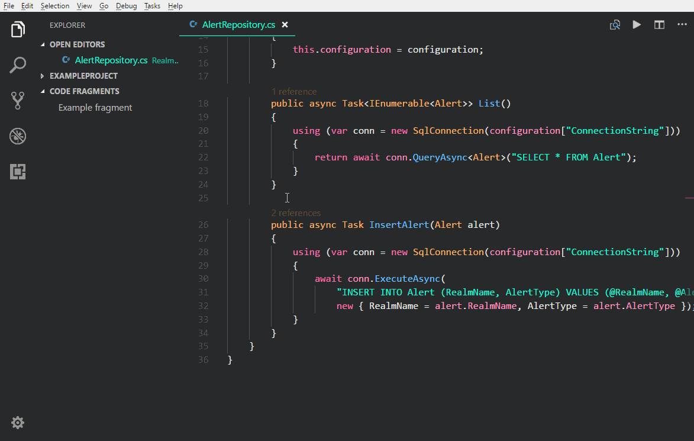
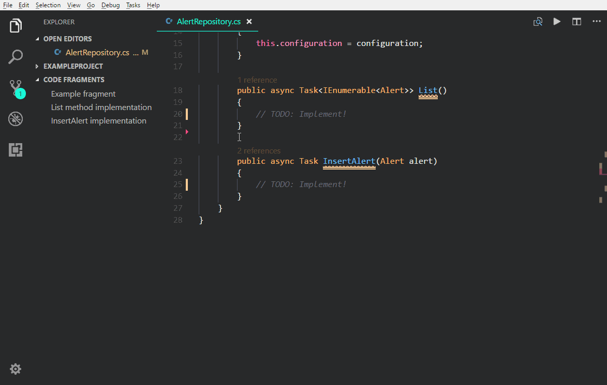

# Code Fragments extension for Visual Studio Code

With this extension you can save static code fragments for later use, and easily insert them into source files whenever needed.  
It can be specifically useful when doing coding demos during presentations.

## Features

After installing the extension, a new section called "CODE FRAGMENTS" is added to the Explorer, which shows a list of the previously saved fragments.  
You can save a piece of code by selecting it in the editor, and then executing the "Save selection as Code Fragment" from the Command Palette (brought up with `Ctrl+Shift+P`) or in the context menu.  
Clicking on an existing fragment in the list inserts its content into the editor at the current cursor position.

Saving a selection as a Code Fragment:

Inserting a Code Fragment to the current cursor position:

## Release Notes

### 1.0.0

Initial release of Code Fragments.